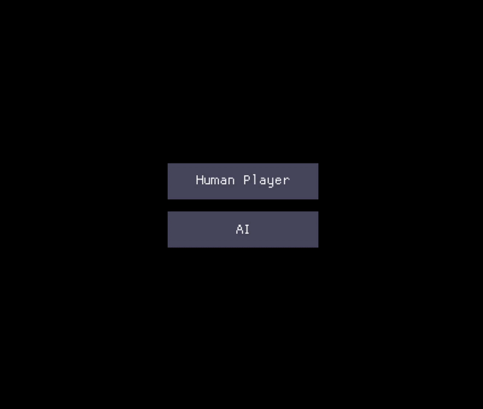

### 1. Overview

This project is an implementation of an RL agent taught to play the game of Snake, built entirely from scratch in Rust. It is composed of three primary components: a custom MLP, a Deep Q-Learning agent, and the Snake game environment itself.

Each component has been thoroughly tested using Rust's native unit testing capabilities, resulting in an effective framework for training the final AI agent.

#### What does "from scratch" mean?

Every core machine learning component—from the `Tensor` data structure to the training loop—was developed without external linear algebra or ML libraries. However, to expedite development on non-core aspects, the project utilizes the following external crates:

* **[rayon](https://docs.rs/rayon/latest/rayon/):** For efficient, multi-threaded computations.
* **[macroquad](https://macroquad.rs/):** For rendering the game window and graphics.
* **[serde](https://serde.rs/) & [bincode](https://docs.rs/bincode/latest/bincode/):** For storing and loading trained models.
* **[rand](https://docs.rs/rand/latest/rand/):** For random number generation.
* **[csv](https://docs.rs/csv/latest/csv/):** For reading CSV files during initial MLP testing.

---

### 2. Multi-Layer Perceptron (MLP)

The MLP framework is designed to be similar to Keras's `Sequential` API, providing a `Sequential` struct that manages a vector of `Layer`s. It orchestrates the forward and backward propagation passes within a training loop to fit the model to data.

The individual components of the MLP include:

1.  **Tensor**
    * The core data structure of the neural network. It uses a flattened `Vec<f32>` for data storage, with `shape` and `strides` vectors to represent data in multiple dimensions.
    * The `Tensor` struct is heavily parallelized with `rayon` for operations like matrix multiplication and its two generalized `map` functions.
    * It uses Rust's `Arc<RwLock<...>>` pointers for fast, efficient, and thread-safe cloning.

2.  **Layer**
    * Implemented as a trait, with concrete structs like `Dense` and `ReLU` implementing its behavior.
    * Each `Layer` provides the core functionality for a `forward` and `backward` pass.

3.  **Loss**
    * The `Loss` trait is implemented by the `MeanSquaredError` struct, which computes the loss between predicted and true `Tensor` values. A `CategoricalCrossentropy` struct was also created to test the network against the MNIST dataset.

4.  **Optimizer**
    * The `Optimizer` trait provides the mechanism to update a network's weights and biases. Stochastic Gradient Descent (`SGD`) was the implemented optimizer for this project.

---

### 3. RL Agent

The agent uses a **Deep Q-Learning (DQN)** algorithm to train the snake AI. It is initialized with a state size and action size and creates a Q-network to predict the expected rewards for each action. The agent's `train()` method orchestrates the entire learning process by running the agent in the game environment for a set number of episodes.

Key features include:

* **Replay Buffer:** Stores past `(state, action, reward, next_state, done)` experiences, which the agent samples from randomly to stabilize training.
* **Target Network:** A separate, slow-updating copy of the main Q-network is used to provide stable targets during learning, a core concept of DQN.
* **Load/Store:** The `Agent` struct includes methods to save a trained model's weights to a file and load them back for later use.

---

### 4. Snake Game

The project includes a complete implementation of the Snake game, which acts as the environment for the agent. The game keeps track of the player's score and can be played by either a human or a trained AI agent, selectable from a menu at the start.

---

### 5. Final Result

 

    

